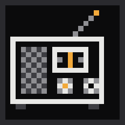
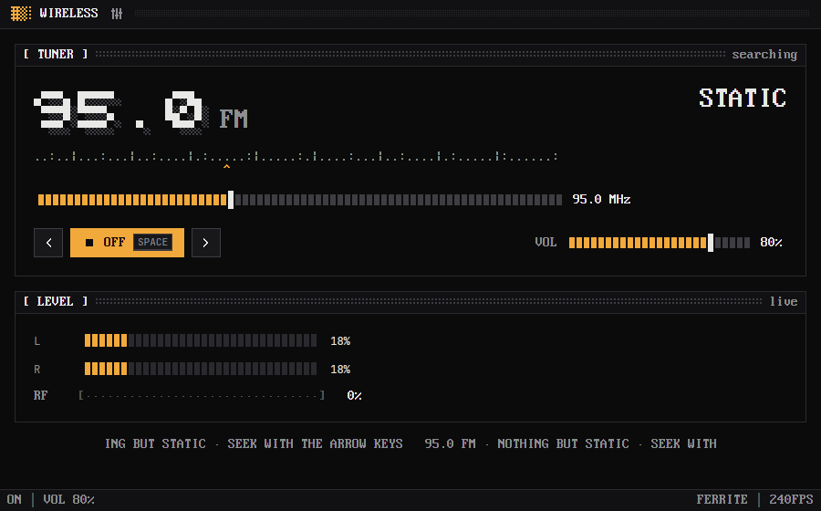

<p align="center">
  
</p>

<h1 align="center">Wireless</h1>

<p align="center">
  A <a href="https://github.com/rwetz/ferrite-design">Ferrite</a> radio for internet streams:
  tune through static, watch the VU meter, read the station off the marquee.
</p>

<p align="center">
  <a href="https://github.com/rwetz/ferrite-wireless/actions/workflows/ci.yml"></a>
  <a href="https://github.com/rwetz/ferrite-wireless/releases/latest"></a>
  <a href="LICENSE"></a>
</p>



Wireless is an internet radio that behaves like a radio. Stations sit at
frequencies on an FM-style dial. Turn it and you pass through static; land
near a station and it fades in out of the hiss, and once the dial settles it
locks on. A two-channel VU meter shows the level, the station, its genre and
the track that's playing scroll by on a marquee, and closing the window cuts
the sound as the picture collapses like an old CRT.

The preset band is eight [SomaFM](https://somafm.com) channels, listener
supported and ad-free: ambient, lo-fi beats, drone, space music, lounge and
more. You can put your own streams on the dial.

It's a native desktop app built with [GPUI](https://gpui.rs) and
[ferrite-design](https://github.com/rwetz/ferrite-design): amber on iron,
0px corners, pixel type and stepped motion. It runs no webview.

## Features

- **Oscilloscope.** A live trace of the mono audio output after volume and static mixing.

- **The dial.** 87.5 to 108.0 MHz in 0.1 steps, with every station marked on
  a text scale and a needle under it. Drag the slider, or seek with
  <kbd>←</kbd> / <kbd>→</kbd> and the dial sweeps to the next station,
  through whatever static lies between.
- **Real static.** Off-station you hear generated static, filtered and
  crackling; near a station the music comes up through it as the signal
  strengthens. The RF gauge shows the signal.
- **VU meter.** Left and right peak levels with a falling needle, live.
- **The marquee.** Frequency, station, genre, and the current track from the
  stream's ICY metadata.
- **Streams.** MP3, AAC and Ogg Vorbis over HTTP(S), decoded with
  [symphonia](https://github.com/pdeljanov/Symphonia) and resampled to your
  output device.
- **Ferrite throughout.** Ten color schemes, a command palette
  (<kbd>Ctrl</kbd>+<kbd>Shift</kbd>+<kbd>P</kbd>) with every station in it,
  a Settings drawer (<kbd>Ctrl</kbd>+<kbd>,</kbd>), and the CRT switch-off.

| Keys | |
|---|---|
| <kbd>Space</kbd> | Switch the set on or off |
| <kbd>←</kbd> <kbd>→</kbd> | Seek down / up |
| <kbd>↑</kbd> <kbd>↓</kbd> | Volume |

## Install

### Download

Prebuilt binaries for Windows, macOS and Linux are attached to each
[release](https://github.com/rwetz/ferrite-wireless/releases/latest).
Unpack the archive and run `ferrite-wireless`. Nothing else is needed.

### From source

```bash
git clone https://github.com/rwetz/ferrite-wireless
cd ferrite-wireless
cargo run --release
```

On Linux you need the usual GPUI development packages first:

```bash
sudo apt install libxkbcommon-dev libxkbcommon-x11-dev libwayland-dev libxcb1-dev libfontconfig-dev libasound2-dev
```

On macOS with Xcode 27 or later, install the Metal toolchain once:

```bash
xcodebuild -downloadComponent MetalToolchain
```

## Your own stations

Add `station` lines to the settings file, `frequency | name | genre | url`
(the genre can be left out). Any station lines replace the preset band:

```ini
station = 90.3 | KEXP | eclectic, Seattle | https://kexp.streamguys1.com/kexp160.aac
station = 94.9 | Fluid | lo-fi beats | https://ice1.somafm.com/fluid-128-mp3
```

Stations closer together than about a megahertz bleed into each other, as
on a real dial.

## Configuration

Settings are saved as plain `key = value` lines:

| OS | Settings |
|---|---|
| Windows | `%APPDATA%\ferrite\wireless.conf` |
| macOS | `~/Library/Application Support/ferrite/wireless.conf` |
| Linux | `$XDG_CONFIG_HOME/ferrite/wireless.conf` (or `~/.config/…`) |

```ini
scheme = ferrite      # ferrite mono graphite slate concrete harbor cyanotype phosphor verdigris bruise
appearance = dark     # dark | light | system
fps = 240             # 12–240; 25 is the classic stepped look
freq = 91.3           # where the dial was left
volume = 0.60         # 0–1
```

| Variable / flag | Effect |
|---|---|
| `--off` | Starts switched off. |
| `--settings` | Starts with Settings open. |
| `FERRITE_*` | The shared look from [Lodestone](https://github.com/rwetz/ferrite-lodestone); provides defaults until the app saves its own preferences. |

## With Lodestone

[Lodestone](https://github.com/rwetz/ferrite-lodestone) launches Ferrite apps
from their **source checkouts**: it scans a folder for crates that depend on
ferrite-design, runs `cargo build`, and starts the result with its shared
look. To see Wireless there, clone this repo next to Lodestone (or into the
folder you point Lodestone at) and have a Rust toolchain on your `PATH`:

```
Dev/
├── ferrite-lodestone/
└── ferrite-wireless/  # appears as a tile in Lodestone
```

A downloaded Wireless binary runs fine on its own, but Lodestone doesn't
discover installed binaries.

## Development

```bash
cargo test                    # the dial, ICY metadata, static, resampling, settings
cargo clippy --all-targets
```

- `src/dial.rs`: the band, signal strength, seeking and the text scale. Pure.
- `src/audio.rs`: the output stream (cpal) that mixes the station with
  static and measures levels, the decoder thread (symphonia) per station,
  ICY metadata stripping, the static generator and the resampler.
- `src/settings.rs`: the settings file and your stations.
- `src/main.rs`: the view. It follows ferrite-design's
  [AGENTS.md](https://github.com/rwetz/ferrite-design/blob/main/AGENTS.md).

On Windows, `build.rs` embeds `assets/logo.ico` as the executable and window
icon. The `.ico` is generated from `assets/logo.svg`, so regenerate it when
the logo changes.

## License

Apache-2.0, see [LICENSE](LICENSE). The binary embeds fonts from
ferrite-design under their own licenses; see [NOTICE](NOTICE).
